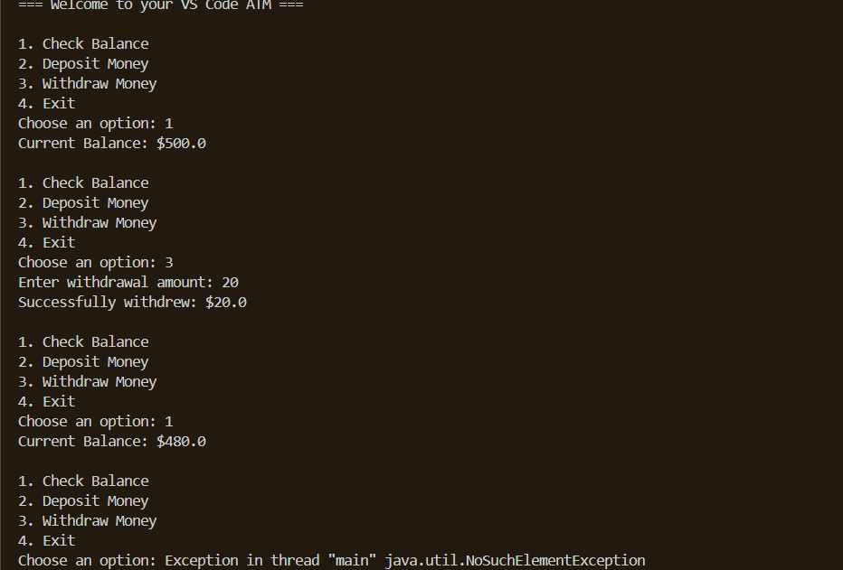

# Simple ATM Simulator
------------------------------------------------------------------------

A beginner-friendly console application built in Java to demonstrate control flow and core operators.

## Preview
---------------------------------------------------------------------

##  How to Run
1. Open the project in VS Code.
2. Ensure you have the Java Extension Pack installed.
3. Open `main.java` and click **Run**.

##  Concepts Covered
* **Arithmetic Operators:** Used for updating bank balances.
* **Relational & Logical Operators:** Used for conditional input checks (e.g., verifying if the withdrawal amount is valid).
* **Scanner Input:** Handling real-time user terminal interactions.
